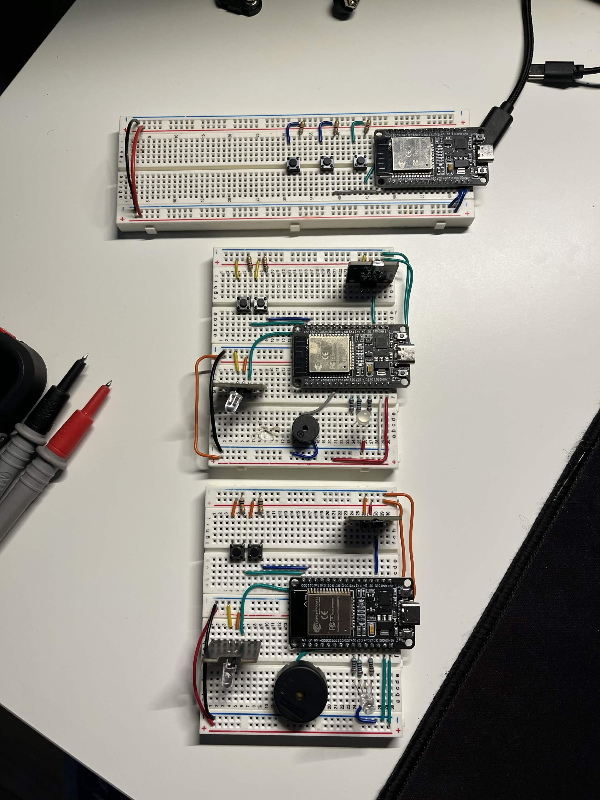

> **Note:** This project is a direct continuation of the [CS362 Group Project](https://github.com/0men1/CS362-Group-Project). Refer to the original repository for the full history of core contributions and initial development phases.

# Embedded Laser Tag

This repository contains the source code for an embedded laser tag system utilizing ESP32 microcontrollers, infrared (IR) communication, and Bluetooth. The system is distributed across blaster nodes and a central controller.

## Architecture

The system operates on an ESP32 hardware foundation.
* **Player Nodes (Blasters/Vests):** Manage IR transmission for firing mechanisms, process incoming IR signal detection, and communicate game state changes to the central server via Wi-Fi.
* **Central Server:** Acts as a Wi-Fi Access Point. Runs an HTTP web server on port 80 to aggregate telemetry, manage global game state, and dispatch commands to player nodes via HTTP POST callbacks.

## Hardware Specifications

* ESP32 Development Board (e.g., ESP32-WROOM-32)
* IR Transmitters (3.3V logic)
* IR Receivers (3.3V logic)
* Tactile Push Buttons
* Piezo Buzzer
* Resistors
* RGB LED

## Hardware Assembly

## Build and Deployment

The codebase is structured in C++ and uses Makefiles for compilation.

Most used commands:

* make flash TARGET=blaster **or** make flash TARGET=central
* make compile TARGET=blaster
* make monitor
